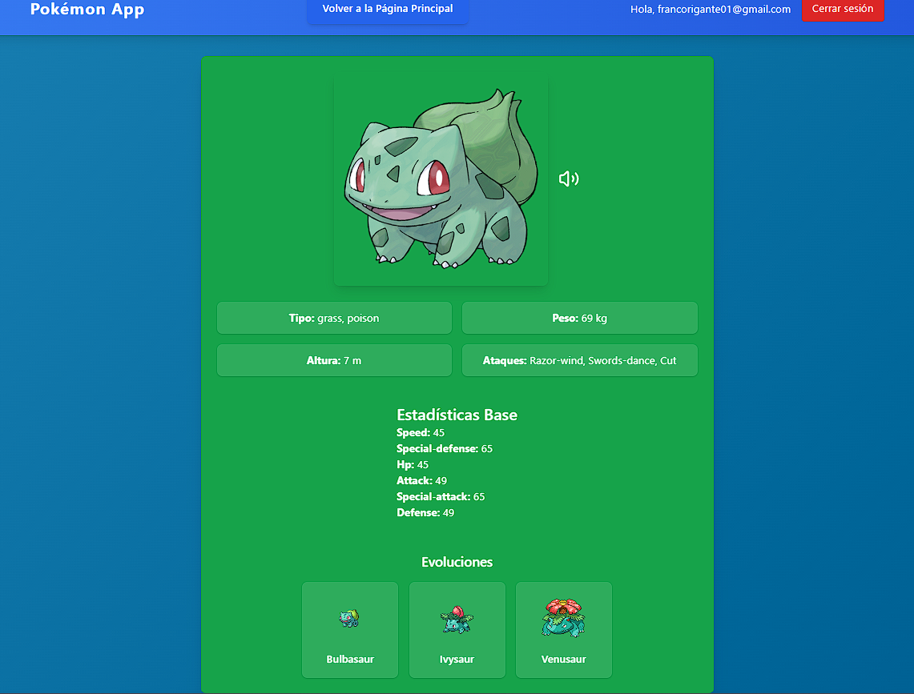

# Pokémon App

¡Bienvenido a **Pokémon App**! Esta aplicación web te permite explorar, buscar y gestionar tu propio equipo Pokémon, con una experiencia moderna y visualmente atractiva.

## 🌐 Demo en línea
¿Quieres probar la app sin instalar nada? Accede aquí:

👉 [pokemon-app-70087.web.app](https://pokemon-app-70087.web.app/)

---

## 🖼️ Capturas de pantalla

<p align="center">
  
  
  
</p>

---

## 🚀 Características principales
- 🔍 **Búsqueda avanzada** de Pokémon por nombre, tipo y generación
- 📋 **Listado interactivo** con paginación e infinite scroll
- 🏆 **Gestión de equipo Pokémon**: agrega, quita y sincroniza tu equipo en la nube
- 🔒 **Autenticación de usuarios** (registro, login y logout)
- 🎵 **Música de fondo** y efectos visuales animados
- ⚡ **Interfaz responsiva** y diseño con Tailwind CSS
- 🔥 **Integración con Firebase** para datos y autenticación

## 🛠️ Tecnologías utilizadas
- React + TypeScript
- Firebase (Auth & Firestore)
- Vite
- Tailwind CSS

## 📦 Instalación
1. Clona el repositorio:
   ```bash
   git clone https://github.com/FrancoRigante01/Pokemon-App.git
   ```
2. Instala las dependencias:
   ```bash
   npm install
   ```
3. Configura tu archivo `.env` con las credenciales de Firebase:
   ```env
   VITE_FIREBASE_API_KEY=tu_api_key
   VITE_FIREBASE_AUTH_DOMAIN=tu_auth_domain
   VITE_FIREBASE_PROJECT_ID=tu_project_id
   VITE_FIREBASE_STORAGE_BUCKET=tu_storage_bucket
   VITE_FIREBASE_MESSAGING_SENDER_ID=tu_messaging_sender_id
   VITE_FIREBASE_APP_ID=tu_app_id
   ```
4. Inicia la app:
   ```bash
   npm run dev
   ```

## ✨ Uso
- Regístrate o inicia sesión para guardar tu equipo Pokémon.
- Explora la lista de Pokémon, filtra por generación o tipo, y agrega tus favoritos a tu equipo.
- Disfruta de la música de fondo y la interfaz animada.

## 📚 Créditos
- Imágenes y datos de Pokémon obtenidos de [PokéAPI](https://pokeapi.co/)
- Iconos y recursos visuales de [Pokémon](https://www.pokemon.com/)

## 📝 Licencia
Este proyecto es de uso educativo y personal. No está afiliado ni respaldado por The Pokémon Company.
